# Fluxo: conversão de volume normal (.dat) para Erasure Coding

Diagrama e explicação do processo completo, do jeito que o SeaweedFS
Enterprise realmente se comporta neste lab — não a documentação oficial
"ideal", mas o que **confirmamos ao vivo** ao longo de todos os testes
desta sessão (`HISTORICO.md`, `RELATO-EC-RATIO-DEV.md`,
`RELATO-EC-AUTO-STUCK-DEV.md`). Onde o comportamento real diverge do
esperado, está marcado explicitamente como **achado/bug confirmado**.

## Diagrama

```mermaid
flowchart TD
    A["Volume normal (.dat)\nrecebendo escritas, replication=000"] --> B

    subgraph FASE1["Fase 1 — Detecção (weed-admin)"]
        B{"Scan periódico do weed-admin\n(ciclo FIXO ~30min a partir do restart —\nscan_interval_seconds é ignorado)"}
        B --> C{"Critérios de elegibilidade"}
        C -->|"fullness_ratio ≥ 0.95\nquiet_for_seconds ≥ 3600\nmin_size_mb ≥ 30"| D["Volume vira candidato a EC"]
        C -->|"não atende ainda"| B
    end

    D --> E

    subgraph FASE2["Fase 2 — Validação de TOPOLOGIA (detection.go)"]
        E["ActiveTopology: snapshot dos racks/\nservidores/discos disponíveis agora"]
        E --> E1["Quantos racks/servidores distintos existem?"]
        E --> E2["Tem espaço livre suficiente em cada destino?"]
        E --> E3["Volume tem réplicas?\n(se sim, só 1 cópia vira EC —\nas outras são purgadas depois)"]
        E1 & E2 & E3 --> F["Planeja N destinos = dataShards+parityShards\n(ex.: 5+2 = 7, lido de ec.config)"]
    end

    F --> G["Task enfileirada:\nec_vol_&lt;id&gt; (erasure_coding)"]

    G --> H{"Qual caminho executa?"}

    H -->|"Automático\n(admin → worker)"| H1["🐛 BUG CONFIRMADO:\ntarefa NUNCA é despachada ao worker —\ncancelada e recriada a cada scan,\npara sempre (RELATO-EC-AUTO-STUCK-DEV.md)"]
    H1 -.->|"nunca acontece"| I

    H -->|"Manual\n(weed shell ec.encode)"| I

    subgraph FASE3["Fase 3 — Geração dos shards"]
        I["generateEcShards:\nvolume de origem vira ReadOnly"]
        I --> K["Codificação Reed-Solomon dos needles"]
        K --> K1["🐛 BUG CONFIRMADO:\nsempre gera o layout clássico 10+4\n(14 shards .ec00-.ec13),\nignora o 5+2 do ec.config\n(RELATO-EC-RATIO-DEV.md, 4 execuções)"]
        K1 --> L["UniformBlockSize arredonda cada shard\npro múltiplo de 1MiB mais próximo\n(desperdício grande em dado pequeno)"]
    end

    L --> M

    subgraph FASE4["Fase 4 — Distribuição entre racks"]
        M["Redistribuição dos 14 shards\nentre racks/servidores disponíveis"]
        M --> M1["🐛 ACHADO CONFIRMADO:\ndistribuição desigual —\nalguns servidores ficam com 2-3 shards,\noutros com 0 (HISTORICO.md 2.11)"]
        M1 --> N["weed shell ec.balance existe\npra corrigir isso depois — não testado"]
    end

    N --> O["Cópias normais originais\nsão purgadas (replicação, se houver)"]
    O --> P["Volume convertido: EC ativo\n(Status: Complete, mas rótulo\nData/Parity na UI usa o ec.config,\nnão o que foi gravado de verdade)"]

    P --> Q

    subgraph FASE5["Fase 5 — Manutenção contínua"]
        Q["Jobs recorrentes do scheduler:\nec_balance · ec_repair ·\nec_bitrot_scrub · ec_vacuum"]
    end
```

## Explicação por fase, com evidência

### Fase 1 — Detecção

O `weed-admin` varre o cluster procurando volumes candidatos a EC. Três
critérios precisam bater ao mesmo tempo (`weed scaffold -config=admin`,
ver `HISTORICO.md` seção 2.6): `fullness_ratio` (padrão 0.95 — volume
quase cheio), `quiet_for_seconds` (padrão 3600 — sem escrita há 1h) e
`min_size_mb` (padrão 30). **Achado confirmado**: o intervalo real desse
scan é fixo em ~30min a partir do restart do processo — o
`scan_interval_seconds` configurável não tem efeito nenhum (confirmado
com 45 scans consecutivos, todos no mesmo minuto do relógio).

### Fase 2 — Validação de topologia

Esta é a parte que você pediu pra destacar. Antes de decidir qualquer
coisa, o `detection.go` monta um snapshot (`ActiveTopology`) do estado
atual do cluster — quantos racks/servidores existem, quanto espaço
livre cada um tem, e se o volume já tem réplicas (nesse caso só 1 cópia
vira EC; as demais são purgadas depois — documentação oficial, citada
em `HISTORICO.md` 2.8). É com base nesse snapshot que ele **planeja**
quantos destinos vai usar. **Esta parte funciona certo**: confirmamos
que o número de destinos planejados bate exatamente com `ec.config`
(5+2 → "Successfully planned 7 destinations", em 100% dos 25 volumes
testados).

### Fase 3 — Geração dos shards

Aqui moram os dois bugs mais graves que documentamos:
- O caminho **automático** planeja corretamente, mas a tarefa nunca é
  de fato executada pelo worker — fica presa num loop de
  cancelar-e-recriar pra sempre.
- O caminho **manual** (`ec.encode` via `weed shell`) executa, só que
  ignora o `ec.config` por completo e sempre grava o layout clássico
  10+4 (14 shards) — confirmado em 4 execuções independentes, incluindo
  depois de mudar a topologia de 14 processos pra 7 servidores reais
  (então não é coincidência de contagem de servidor).

### Fase 4 — Distribuição entre racks

Depois de gerados, os 14 shards são espalhados entre os servidores
disponíveis. Achamos que essa distribuição **não é perfeitamente
equilibrada** — em um teste com 7 servidores reais disponíveis pra 14
shards, alguns ficaram com 3 shards cada e outros com 0 (ver
`HISTORICO.md` 2.11, e a tela do dashboard "11 Servers" em vez de 14).
Existe um comando (`ec.balance`) feito exatamente pra corrigir isso,
mas nunca testamos se ele resolve.

### Fase 5 — Manutenção contínua

Depois de convertido, o volume EC passa a ser cuidado por 4 tipos de
tarefa recorrente que aparecem no scheduler (`ec_balance`, `ec_repair`,
`ec_bitrot_scrub`, `ec_vacuum`) — nunca investigamos o comportamento
detalhado de nenhum desses, ficam como possíveis próximas POCs.

## Resumo — o que está confirmado certo vs. confirmado com bug

| Etapa | Status |
|---|---|
| Critérios de elegibilidade (fullness/quiet/min_size) | Funciona, mas o intervalo do scan é fixo (ignora config) |
| Validação de topologia + planejamento de destinos | **Correto** — respeita `ec.config` |
| Despacho automático da tarefa pro worker | **Bug — nunca executa** |
| Geração dos shards (`ec.encode` manual) | **Bug — sempre 10+4, ignora `ec.config`** |
| Distribuição entre racks | Funciona, mas desigual (não testamos `ec.balance`) |
| Manutenção contínua pós-EC | Não testado ainda |

## Referências
- [HISTORICO.md](HISTORICO.md) — seções 2.6 a 2.14
- [RELATO-EC-RATIO-DEV.md](RELATO-EC-RATIO-DEV.md)
- [RELATO-EC-AUTO-STUCK-DEV.md](RELATO-EC-AUTO-STUCK-DEV.md)
