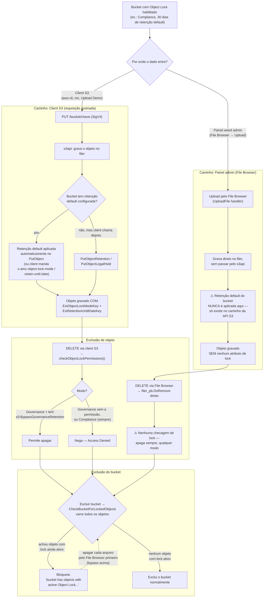

# Fluxo: Object Lock — upload/exclusão via Client S3 x Painel Admin

Diagrama de como a mesma configuração de Object Lock (Governance/Compliance,
30 dias de retenção default) tem efeito completamente diferente dependendo
de o dado entrar/sair pela API S3 ou pelo File Browser do `weed admin`.
Testado e confirmado no lab (ver `CONFIGURACOES-DE-PERMISSOES.md`).

## Diagrama

## Leitura rápida

- **Tudo via client S3**: objeto nasce com retenção → `DELETE` do objeto
  respeita Governance/Compliance → excluir o bucket fica bloqueado enquanto
  existir objeto travado.
- **Tudo via painel (File Browser)**: objeto nasce **sem** retenção, porque
  esse caminho não passa pelo código que aplica a configuração de Object
  Lock do bucket → excluir bucket funciona direto, em um passo.
- **Misto** (algum objeto veio de client S3): excluir bucket é bloqueado,
  mas cada arquivo travado pode ser apagado individualmente pelo File
  Browser (que nunca checa lock) → esvazia o bucket → aí o bucket sai.

## Referências
- [CONFIGURACOES-DE-PERMISSOES.md](CONFIGURACOES-DE-PERMISSOES.md)
- `weed/s3api/s3api_object_retention.go` (checagem no client S3)
- `weed/admin/handlers/file_browser_handlers.go` (Upload/DeleteFile do painel)
- `weed/s3api/s3_objectlock/object_lock_check.go` (checagem na exclusão de bucket)
