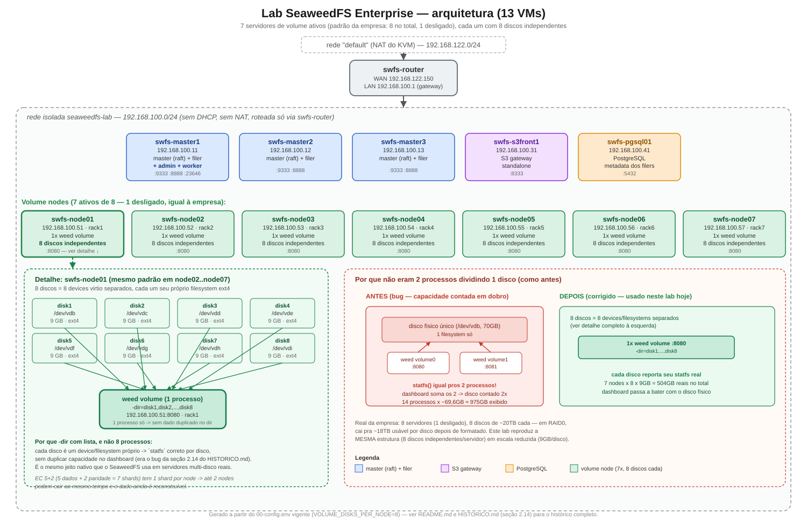

# Lab SeaweedFS Enterprise — KVM/libvirt + cloud-init

Ambiente de laboratório para estudo do [SeaweedFS](https://github.com/seaweedfs/seaweedfs)
(edição Enterprise), completamente automatizado com KVM/libvirt e cloud-init:
um comando sobe a topologia inteira — 13 VMs, rede, roteamento e o cluster
já rodando, EC 5+2 configurado — e outro comando desmonta tudo.

## Objetivo do projeto

Laboratório completo de storage distribuído com SeaweedFS — S3 front,
master/filer, PostgreSQL como metadata store e 7 volume nodes com erasure
coding 5+2 — pra estudar e validar comportamento do sistema na prática.
Nenhum passo de infraestrutura é manual — da VM em branco ao cluster
respondendo é tudo `./deploy-lab.sh`. Cada rodada de teste vira um
documento de POC isolado (ver `POCS.md` e `HISTORICO.md`) em vez de
anotação solta.

## Instalação rápida (clonando pela primeira vez)

- **Linux no host** (depende de KVM/libvirt — não roda em Windows/Mac).
- **Virtualização habilitada na BIOS/UEFI** (Intel VT-x / AMD-V) — confirme com `kvm-ok || ls /dev/kvm`.
- **~19 GB de RAM livre** e **~650 GB de disco livre** (thin-provisioned — uso real inicial é bem menor; veja "Requisitos" abaixo para o detalhamento).

```bash
git clone <url-do-repositorio>
cd SeaweedFS

sudo apt update
sudo apt install -y virtinst libvirt-clients libvirt-daemon-system \
                     qemu-utils cloud-image-utils wget xz-utils virt-manager

# seu usuário precisa falar com o libvirt sem sudo:
groups | grep -E "libvirt|kvm" || { sudo usermod -aG libvirt,kvm "$USER"; echo "faça logout/login"; }

chmod +x *.sh
./deploy-lab.sh
```

`virt-manager` é opcional para os scripts (tudo roda via `virsh`), mas útil
para abrir o **console gráfico** de qualquer VM (como um monitor conectado
nela) — principalmente as 5 VMs cujo SSH pode ficar instável sob carga do
host (ver "Notas técnicas").

`./deploy-lab.sh` pergunta o modelo de **replicação padrão** do cluster no
meio do processo — Enter mantém `000` (nenhuma cópia extra; o objetivo deste
lab é testar erasure coding 5+2, não replicação). Leva alguns minutos até o
cluster inteiro responder. Confira com `./06-status.sh` — espera-se
`HTTP 200`/`UP` em todos os serviços.

## Arquitetura

13 VMs Ubuntu Server 24.04 (12 do cluster + 1 roteador):

```
                         rede "default" (NAT do KVM, já existente)
                                    │
                              [ swfs-router ]  <- IP forwarding + NAT (iptables), automático
                       WAN 192.168.122.150 │  │ LAN 192.168.100.1/24
                                           │  │
                    rede isolada "seaweedfs-lab" (sem DHCP, sem NAT, sem rota do host)
                                           │
        ┌────────────┬────────────┬───────┴────┬─────────────┬──────────────────────────┐
   swfs-master1  swfs-master2  swfs-master3  swfs-s3front1  swfs-pgsql01   swfs-node01..07
    .11 (raft)     .12 (raft)    .13 (raft)      .31            .41         .51-.57
   +filer+admin    +filer        +filer      S3 gateway     PostgreSQL    volume, 8 discos
   +worker                                    standalone    (metadata      (7 racks,
                                                              dos filers)   EC 5+2)
```



| VM | Papel | IP | RAM | vCPU | Disco |
|---|---|---|---|---|---|
| swfs-router | Roteador (gateway/NAT do lab, automático) | 192.168.122.150 (WAN) / 192.168.100.1 (LAN) | 1024 MB | 1 | 10 GB |
| swfs-master1 | `weed master` (raft) + `weed filer` + `weed admin` + `weed worker` | 192.168.100.11 | 1536 MB | 1 | 12 GB |
| swfs-master2 | `weed master` (raft) + `weed filer` | 192.168.100.12 | 1536 MB | 1 | 12 GB |
| swfs-master3 | `weed master` (raft) + `weed filer` | 192.168.100.13 | 1536 MB | 1 | 12 GB |
| swfs-s3front1 | `weed s3` standalone (gateway S3 puro, aponta pros 3 filers) | 192.168.100.31 | 1024 MB | 1 | 10 GB |
| swfs-pgsql01 | PostgreSQL — metadata store dos 3 filers (troca o LevelDB embutido) | 192.168.100.41 | 1536 MB | 1 | 20 GB |
| swfs-node01..07 | `weed volume` — 1 processo por node, dono de 8 discos independentes = 7 volume servers, 1 por rack (rack1-rack7) | 192.168.100.51-.57 | 1536 MB cada | 1 cada | 10 GB SO + 8× 9 GB dados (discos separados) cada |

Por que essa topologia (e não a mínima):
- **3 masters** — Raft precisa de quorum ímpar ≥3 para eleição/failover ter algo a demonstrar.
- **`weed s3` separado do filer** (`swfs-s3front1`) — gateway S3 standalone, 1 VM que fala com os 3 filers, sem depender de nenhum deles individualmente pra atender requisição.
- **PostgreSQL como metadata store** (`swfs-pgsql01`) — substitui o LevelDB local de cada filer, que vira gargalo de concorrência quando múltiplos filers escrevem ao mesmo tempo; os 3 filers compartilham o mesmo banco.
- **7 volume nodes, 1 processo + 8 discos independentes cada, 1 rack por node** — discos independentes (não pastas de 1 disco só) de propósito: cada um vira um device/filesystem próprio, então o `statfs` que o `weed volume` usa pra reportar espaço livre sai correto por disco — ver `HISTORICO.md` sobre o bug de capacidade em dobro que uma topologia de "processos dividindo 1 disco" causava. Alvo do erasure coding 5+2 (5 dados + 2 paridade = 7 shards, 1 por node): perde-se até 2 racks/nodes e o dado ainda é reconstruível.

## Requisitos

**Soma dos recursos alocados pela topologia (mínimo para rodar as 13 VMs simultaneamente):**

| Recurso | Total | Composição |
|---|---|---|
| RAM | ~18,5 GB | masters 3×1536 + s3front 1024 + pgsql 1536 + nodes 7×1536 + router 1024 (MB) |
| vCPU | 13 | 1 por VM (aceita overcommit do KVM) |
| Disco (SO) | ~146 GB | masters 3×12 + s3front 10 + pgsql 20 + nodes 7×10 + router 10 (GB) |
| Disco (dados) | ~504 GB | só os 7 volume nodes, 8 discos independentes de 9 GB cada (72 GB/node) — 504 GB brutos, ~360 GB úteis com EC 5+2 (eficiência 5/7) |
| Virtualização | `/dev/kvm` presente | confirme com `kvm-ok` (pacote `cpu-checker`) ou `ls /dev/kvm` |

Os discos são thin-provisioned (qcow2 com backing file) — o espaço acima é o
teto alocável, não o uso real inicial. RAM/vCPU/disco por VM são
configuráveis em `00-config.env` (`VM_RAM_MB`, `VM_VCPUS`,
`VM_OS_DISK_SIZE`, `VM_DATA_DISK_SIZE`) para hosts mais modestos.

**Ambiente em que este lab foi validado:** host Ubuntu, AMD Ryzen 5 2600 (6
núcleos/12 threads), 30 GB RAM — já observado sob pressão (load >2, uso de
swap) com as 13 VMs + `weed` de pé; ver "Notas técnicas" sobre o efeito
colateral disso no SSH de algumas VMs.

## Conceitos do SeaweedFS usados neste lab

- **Master** — o cérebro do cluster. Não guarda arquivos: mantém o mapa de
  qual *volume* está em qual *volume server*, distribui IDs novos e elege
  um líder entre si via **Raft** (por isso 3 masters). `192.168.100.11-13:9333`.
- **Volume / Volume Server** — unidade real de armazenamento: um arquivo
  grande (`.dat`) onde o SeaweedFS empacota muitos objetos pequenos
  ("needles") lado a lado. O *volume server* informa ao master seu
  **rack**/**datacenter**, usado nas regras de replicação e no placement de
  erasure coding. Selar (ficar `ReadOnly`) acontece automaticamente e quase
  na hora que o volume atinge `-volumeSizeLimitMB` — não depende de nenhum
  ciclo de varredura.
- **Filer** — camada com namespace hierárquico (pastas/arquivos) acima dos
  volumes; aqui, os 3 filers (um por master) compartilham metadado via
  **PostgreSQL** em vez do LevelDB local. Porta `8888`.
- **S3 API** — gateway compatível S3, aqui rodando **separado** do filer, em
  `swfs-s3front1:8333` (`weed s3` standalone falando com os 3 filers).
- **Admin + Worker** — `weed admin` (dashboard web, `swfs-master1:23646`) e
  `weed worker` (execução de tarefas de manutenção em background: EC
  encode, vacuum, balance) rodam os dois em `swfs-master1`. O scan de
  manutenção do admin roda em ciclo **fixo de 30min a partir do restart do
  processo** — os limiares (`fullness_ratio`, `quiet_for_seconds`) mudam
  *quem qualifica*, não *quando* o scan roda; e o `scan_interval_seconds`
  não tem efeito nenhum (achado confirmado, ver `HISTORICO.md`).
- **Replicação** — código de 3 dígitos **datacenter-rack-node** por volume
  (`-replication`, ex. `010` = 1 cópia extra em outro rack). Padrão deste
  cluster é `000` (nenhuma cópia extra, `MASTER_DEFAULT_REPLICATION` em
  `00-config.env`) — de propósito, para isolar o teste de erasure coding.
- **Erasure Coding (EC)** — mecanismo de redundância alternativo à
  replicação: quebra um volume em *shards* de dados + paridade. Este
  cluster usa **5+2** (`EC_DATA_SHARDS`/`EC_PARITY_SHARDS` em
  `00-config.env`, aplicado via `ec.config -set` automaticamente no fim do
  `deploy-lab.sh`) — 5 shards de dado + 2 de paridade = 7, 1 por rack,
  tolerando a perda de até 2 racks/nodes. **Cuidado**: nem todo caminho de
  EC deste build respeita esse ratio configurado — ver `HISTORICO.md` para
  os achados detalhados (`ec.encode` manual sempre usa 10+4; o automático
  planeja 5+2 corretamente mas trava antes de executar).

## Passo a passo do deploy

```bash
./deploy-lab.sh
```

Executa em sequência:

1. **`01-baixar-imagem.sh`** — baixa a cloud image Ubuntu 24.04 para `Imagens/` (uma vez; reaproveitada por todas as VMs).
2. **`02-criar-discos.sh`** — cria disco de SO (+ disco de dados nos volume nodes) de cada VM, como overlay da imagem-base.
3. **`03-configurar-rede.sh`** — cria a rede isolada `seaweedfs-lab` e reserva o IP fixo do roteador na rede `default`.
4. **`04-gerar-cloud-init.sh`** — pergunta o modelo de replicação padrão, gera a chave SSH do cluster e o seed cloud-init de cada VM (IP estático, timezone `America/Sao_Paulo`, disco de dados formatado/montado em `/data` quando aplicável, binário `weed` baixado, serviços systemd do papel de cada VM habilitados no boot).
5. **`05-criar-vms.sh`** — sobe o roteador primeiro (as demais VMs precisam de internet já no primeiro boot), depois o resto.
6. **`06-status.sh`** — mostra o estado de cada VM e checa HTTP de cada serviço.
7. Ao final, `deploy-lab.sh` aplica `ec.config -set -dataShards=5 -parityShards=2` no cluster já de pé.

Scripts individuais (todos idempotentes — se algo já existe, avisam e seguem):
```bash
./01-baixar-imagem.sh
./02-criar-discos.sh
./03-configurar-rede.sh
./04-gerar-cloud-init.sh
./05-criar-vms.sh
./06-status.sh
./08-atualizar-seaweed.sh   # atualiza o binário weed numa VM já rodando
./07-destruir-lab.sh
```

## Serviços e verificação

`./06-status.sh` testa, via SSH, o endpoint HTTP de cada serviço **de
dentro da própria VM** (evita depender de rota do host) e reporta o código:

| VM(s) | Serviço | Porta | Checagem |
|---|---|---|---|
| swfs-master1/2/3 | master (raft) | 9333 | `/cluster/status` → HTTP 200 |
| swfs-master1/2/3 | filer | 8888 | HTTP 200 |
| swfs-master1 | admin (dashboard web) | 23646 | HTTP 200 |
| swfs-master1 | worker | — | `systemctl is-active weed-worker` |
| swfs-s3front1 | S3 API | 8333 | 403 sem credenciais (esperado, ver abaixo) |
| swfs-s3front1 | métricas S3 (Prometheus) | 9327 | `/metrics` |
| swfs-s3front1 | página de demo de upload S3 | 8090 | HTTP 200 |
| swfs-pgsql01 | PostgreSQL | 5432 | `systemctl is-active postgresql` |
| swfs-node01..07 | volume (1 processo, 8 discos) | 8080 | `/status` → HTTP 200 |

A API S3 exige credenciais: `weed s3` sobe com `-s3.config` apontando pro
`s3.json` gerado no cloud-init (identidade `S3_ACCESS_KEY`/`S3_SECRET_KEY`
de `00-config.env` — valores fixos de lab, troque antes de expor isso fora
do seu host). Um GET anônimo retorna `403 Access Denied` — é o gateway
recusando por falta de assinatura, não um sinal de serviço fora do ar.

```bash
curl -s http://192.168.100.31:8333/          # 403 AccessDenied (sem credenciais)
curl -s http://192.168.100.11:8888/          # UI do Filer (não exige S3 auth)

# cliente S3 de verdade (mc, aws s3, rclone...) aponta pro s3front:
mc alias set swfslab http://192.168.100.31:8333 "$S3_ACCESS_KEY" "$S3_SECRET_KEY"
mc mb swfslab/meu-bucket && mc cp algum-arquivo swfslab/meu-bucket/
```

Pra abrir os dashboards (admin, filer) num navegador de verdade, túnel SSH
pelo roteador:
```bash
ssh -N -L 23646:192.168.100.11:23646 -L 8888:192.168.100.11:8888 -L 8090:192.168.100.31:8090 \
    -o ProxyCommand="ssh -W %h:%p swfs@192.168.122.150" swfs@192.168.100.11
```
depois `http://localhost:23646` (admin) / `http://localhost:8888` (filer) /
`http://localhost:8090` (demo de upload) no navegador do host. Sem
`-adminPassword`, a autenticação do admin fica desabilitada — aceitável só
para lab.

## Acesso SSH

A rede `seaweedfs-lab` é um switch L2 isolado no libvirt — sem DHCP, sem
NAT, sem rota do host por padrão. A forma garantida de alcançar qualquer VM
do lab a partir do terminal do host é pulando pelo roteador:

```bash
ssh swfs@192.168.122.150                                              # direto ao roteador
ssh -o ProxyCommand="ssh -W %h:%p swfs@192.168.122.150" swfs@192.168.100.11   # pulando pro resto
```

Um bloco assim no `~/.ssh/config` do host deixa isso transparente
(`ssh swfs-master1` já funciona direto depois):
```
Host swfs-router
    HostName 192.168.122.150
    User swfs

Host swfs-master1 swfs-master2 swfs-master3 swfs-s3front1 swfs-pgsql01 swfs-node01 swfs-node02 swfs-node03 swfs-node04 swfs-node05 swfs-node06 swfs-node07
    ProxyJump swfs-router
    User swfs

Host swfs-master1
    HostName 192.168.100.11
Host swfs-master2
    HostName 192.168.100.12
Host swfs-master3
    HostName 192.168.100.13
Host swfs-s3front1
    HostName 192.168.100.31
Host swfs-pgsql01
    HostName 192.168.100.41
Host swfs-node01
    HostName 192.168.100.51
Host swfs-node02
    HostName 192.168.100.52
Host swfs-node03
    HostName 192.168.100.53
Host swfs-node04
    HostName 192.168.100.54
Host swfs-node05
    HostName 192.168.100.55
Host swfs-node06
    HostName 192.168.100.56
Host swfs-node07
    HostName 192.168.100.57
```
Senha padrão de todos os usuários (`swfs`): `swfs123` (ou a chave SSH do
host, adicionada automaticamente).

**"WARNING: REMOTE HOST IDENTIFICATION HAS CHANGED" após um redeploy** — é
esperado, não é um ataque: as chaves de host SSH de cada VM são geradas
pelo cloud-init no primeiro boot, então qualquer VM recriada sobe com chave
diferente da que o `known_hosts` tinha guardado. Como o acesso passa por
dois saltos, às vezes o erro aparece duas vezes seguidas (roteador + VM
final). Depois de todo redeploy, limpe as entradas de uma vez:
```bash
for ip in 192.168.122.150 192.168.100.11 192.168.100.12 192.168.100.13 192.168.100.31 192.168.100.41 \
          192.168.100.51 192.168.100.52 192.168.100.53 192.168.100.54 192.168.100.55 192.168.100.56 192.168.100.57; do
  ssh-keygen -f ~/.ssh/known_hosts -R "$ip"
done
```

**Atalho opcional, não automatizado pelos scripts**: se o host tiver uma
rota estática pra `192.168.100.0/24` via `192.168.122.150` (`ip route add
192.168.100.0/24 via 192.168.122.150`), SSH direto às VMs do lab funciona
sem `ProxyCommand`/`ProxyJump`. Essa rota não é criada por nenhum script
deste repositório nem sobrevive a um reboot do host — é conveniência
manual, não depender dela em documentação/automação.

## Console gráfico (alternativa ao SSH)

Sob carga do host (13 VMs + `weed` de pé), o `sshd` de algumas VMs pode
ficar instável (`Connection reset by peer` logo após o handshake — visto
em produção deste lab, não um bug do SeaweedFS). O processo `weed` em si
não é afetado (confirmável via `curl` nos endpoints HTTP mesmo com SSH
fora). Nesse caso, use o console gráfico do `virt-manager`/`virt-viewer`
(como um monitor conectado na VM) em vez de insistir no SSH:
```bash
virt-manager   # ou: virt-viewer <nome-da-vm>
```

## `weed shell` — inspecionar o cluster

De qualquer VM do cluster (o binário `weed` já está em
`/usr/local/bin/weed`), abra um shell apontando pra qualquer master — ele
descobre o líder Raft sozinho:
```bash
weed shell -master=192.168.100.11:9333
```

| Comando | Para que serve |
|---|---|
| `cluster.status` / `cluster.raft.ps` | visão geral / status do quorum Raft |
| `volume.list` | todos os volumes: id, servidor, tamanho, replicação, coleção, shards EC |
| `collection.list` | coleções (buckets) existentes |
| `ec.config -get` / `-set -dataShards=N -parityShards=M` | ratio de erasure coding, global ou por coleção |
| `s3.bucket.create -name=<b> [-withLock]` | criar bucket (com Object Lock opcional) |
| `s3.bucket.quota -name=<b> -op=set -sizeMB=<n>` | cota de bucket |
| `fs.ls /caminho` / `fs.du /caminho` | navegar/medir o namespace do Filer |

Comandos que alteram estado (exigem `lock`/`unlock` no shell):
`volume.vacuum`, `volume.balance`, `volume.fix.replication`,
`volume.check.disk`, `volume.fsck`, `ec.encode` (cuidado: manual, ver nota
de EC acima e `HISTORICO.md`).

## Comandos úteis por papel (via SSH/console)

```bash
# Master (swfs-master1/2/3, porta 9333)
curl -s "http://localhost:9333/cluster/status?pretty=y"
curl -s "http://localhost:9333/dir/status?pretty=y"      # topologia: dc/racks/volume servers
journalctl -u weed-master -f

# Volume (swfs-node01..07, porta 8080, 1 processo com 8 discos independentes)
curl -sI "http://localhost:8080/healthz"
curl -s  "http://localhost:8080/status?pretty=y"   # inclui DiskStatuses -- 1 entrada por disco, cada um com seu próprio statfs
journalctl -u weed-volume -f
df -h /data/disk*   # cada disco é um device/filesystem separado -- não existe 1 "df -h /data" só

# Filer (swfs-master1/2/3, porta 8888)
curl -H "Accept: application/json" "http://localhost:8888/buckets/?pretty=y"
journalctl -u weed-filer -f

# S3 front (swfs-s3front1, porta 8333)
aws --endpoint-url http://localhost:8333 s3 ls
journalctl -u weed-s3 -f

# Admin + Worker (swfs-master1)
journalctl -u weed-admin -f    # scan de manutenção, detecção de EC
journalctl -u weed-worker -f   # execução das tarefas (ec_balance, balance...)

# PostgreSQL (swfs-pgsql01)
sudo -u postgres psql -d seaweedfs_filer
```

## Destruir

```bash
./07-destruir-lab.sh                  # remove as 13 VMs e seus discos
./07-destruir-lab.sh --clean-net      # + remove a rede isolada e a reserva de IP do roteador
./07-destruir-lab.sh --purge          # + remove as imagens em Imagens/ e a chave do cluster
```
A rede `default` do KVM (usada como WAN do roteador) nunca é destruída — só
a reserva de IP que este lab adicionou nela.

## Organização de diretórios

```
SeaweedFS/
├── Imagens/                      # cloud image base, compartilhada
├── swfs-master1/  swfs-node01/  swfs-router/ ...   # estado de cada VM (disco overlay, disco de dados, seed cloud-init)
├── FILES-TESTE/                  # arquivos de teste gerados/usados nas POCs (grandes, fora do essencial do repo)
├── cluster_key / cluster_key.pub # chave SSH exclusiva do cluster
├── 00-config.env ... 08-atualizar-seaweed.sh, deploy-lab.sh
├── README.md                     # este arquivo — arquitetura, instalação, operação
├── HISTORICO.md                  # tudo que já foi testado e descoberto, em ordem cronológica
├── COMANDOS.md                   # referência direta: comandos de administração (EC, versionamento, volumes)
├── POCS.md                       # índice dos POC-N.md (um documento por teste, a partir de agora)
├── RELATO-EC-RATIO-DEV.md        # relato formal (EN) pro dev/suporte — bug do ec.encode manual
├── RELATO-EC-AUTO-STUCK-DEV.md   # relato formal (EN) pro dev/suporte — bug da fila de EC automática
└── POC-I.md, POC-II.md, ...      # um documento por teste novo, a partir de agora
```

Regra para extensões futuras: imagens-base sempre em `Imagens/`; estado de
cada VM sempre numa pasta com o nome dela, criada e destruída junto; a raiz
fica só com scripts, docs de referência (este README) e a chave do
cluster. **Cada teste novo vira seu próprio `POC-N.md`** — não volta a
crescer um documento corrido único; achados que valem virar referência
permanente (bugs confirmados, comportamento do sistema) sobem pra
`HISTORICO.md` ou pra este README, conforme o caso.

## Notas técnicas

- **`write_files` roda antes de `users-groups` no cloud-init real
  (Ubuntu).** Escrever arquivos em `/home/<usuário>/...` sem `defer: true`
  falha silenciosamente (o diretório ainda não existe) e derruba o
  `write_files` inteiro, inclusive entradas não relacionadas no mesmo
  arquivo. A correção está em `04-gerar-cloud-init.sh`, nas entradas
  marcadas com `defer: true`.
- **Fuso horário**: todas as VMs nascem em `America/Sao_Paulo` (chave
  `timezone:` no cloud-init, `04-gerar-cloud-init.sh`) — a imagem base do
  Ubuntu vem em UTC por padrão, e isso já causou confusão comparando
  timestamps de log entre host e VM antes de ser corrigido.

## Reconfigurar

Tudo está centralizado em `00-config.env`: nomes/IP/MAC/RAM/vCPU/disco de
cada VM, papéis do SeaweedFS (`ADMIN_HOST`, `WORKER_HOST`, `S3FRONT_HOSTS`,
`PGSQL_HOST`, `VOLUME_NODES`, `VM_RACK`), portas, credenciais S3 e
PostgreSQL, ratio de erasure coding (`EC_DATA_SHARDS`/`EC_PARITY_SHARDS`) e
versão do SeaweedFS (`SEAWEED_VERSION`, ou o par
`SEAWEED_ENTERPRISE_REPO`/`SEAWEED_ENTERPRISE_ASSET` para a edição
Enterprise). O modelo de replicação padrão não fica fixo — é perguntado a
cada `./04-gerar-cloud-init.sh` (direto ou via `deploy-lab.sh`).

## Referências

- [HISTORICO.md](HISTORICO.md) — tudo que já foi testado e descoberto, em ordem cronológica.
- [POCS.md](POCS.md) — índice dos testes documentados individualmente (`POC-N.md`).
- Docs oficiais SeaweedFS: https://github.com/seaweedfs/seaweedfs/wiki
