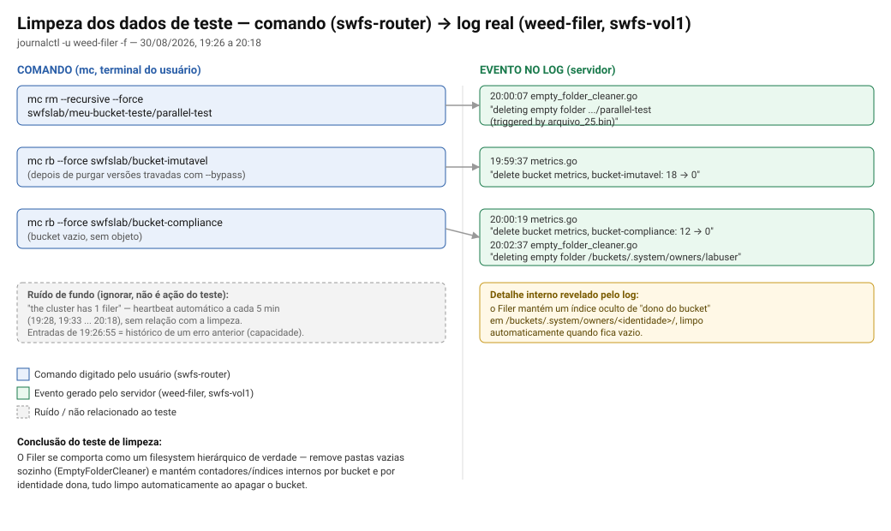

# Relatório de testes — SeaweedFS lab

Registro técnico das observações feitas durante os testes de upload/S3 no
lab (ver [README.md](README.md) para a arquitetura completa e
[00-config.env](00-config.env) para os parâmetros do ambiente).

## 1. Fluxo de recebimento de um arquivo (upload)

Quando um cliente (S3 API, `rclone`, `mc`, a página de demo, etc.) envia um
arquivo, o trabalho é dividido entre três papéis, cada um responsável por
uma parte diferente:

```
Cliente (assina a requisição com AWS Signature V4)
        │  PUT http://swfs-vol1:8333/<bucket>/<chave>
        ▼
Filer (swfs-vol1:8333) — plano de metadado
        │  quebra o arquivo em pedaços (chunks)
        │  para cada chunk, pede ao Master um volume+ID onde gravar
        ▼
Master (raft leader, um dos swfs-master1/2/3:9333) — plano de controle
        │  responde com um volume já "grávavel" existente
        │  se a reserva de volumes grávaveis estiver baixa, manda CRIAR
        │  volumes novos nos volume servers (em lote, não um por vez) e
        │  atualiza seu mapa de topologia em memória
        ▼
Volume Server (swfs-vol1 ou swfs-vol2:8080) — plano de dados
        │  recebe os bytes DIRETO do filer (não passa pelo master de novo)
        │  grava no arquivo .dat (append) + atualiza o índice .idx
        ▼
Filer grava o "manifesto" do arquivo (lista de chunks) no seu metadado
local (LevelDB, em /data/filer/filerldb2 no swfs-vol1)
```

Ponto chave da arquitetura: o **master nunca vê os bytes do arquivo** — ele
só aloca IDs e mantém o mapa de "o que está onde". Os bytes trafegam
direto entre o filer e o volume server. É essa separação que permite o
cluster escalar sem o master virar gargalo.

## 2. Observação prática: CPU/memória durante um upload paralelo

Teste realizado: 25 arquivos de 200MB (4,9GB no total) enviados com
`rclone copy --transfers 8` (8 uploads simultâneos), simulando vários
clientes gravando ao mesmo tempo.

**Padrão observado no virt-manager:** CPU subiu primeiro nos volume
servers (`swfs-vol1`/`swfs-vol2`), memória subiu logo depois nos masters.

**Explicação, confirmada consultando o cluster ao vivo:**

- **CPU nos volumes primeiro** — é o trabalho síncrono e direto: gravar os
  bytes no `.dat` (append) e calcular o checksum de cada needle. Reage na
  hora porque é I/O real acontecendo.
- **Memória nos masters logo depois** — à medida que os volumes existentes
  enchiam, o master precisou criar volumes novos para continuar aceitando
  escrita. Confirmado via `/dir/status` do master: o cluster tinha 14
  volumes no total após o teste (7 em cada rack), contra bem menos antes
  do teste. O SeaweedFS cria volumes em lote (não um de cada vez) quando a
  reserva de "volumes grávaveis" fica baixa — por isso o efeito aparece em
  rajada, um pouco depois do início do upload, não simultâneo. Cada volume
  novo é uma entrada a mais no mapa de topologia que o master mantém 100%
  em memória (RAM), nunca em disco — daí o aumento de memória.

**Sobre a memória "não baixar" no `swfs-vol2`:** checado com `free -h`
dentro das VMs, não `virsh`/virt-manager (mais confiável para essa
leitura):

| | `swfs-vol1` | `swfs-vol2` |
|---|---|---|
| RAM usada de verdade (`used`) | 546 MiB | 384 MiB |
| Cache de disco (`buff/cache`) | 906 MiB | 1,6 GiB |
| Disponível se precisar (`available`) | 1,4 GiB | 1,5 GiB |
| RSS do processo `weed` | ~100-210 MiB (3 processos: volume+filer+admin) | ~103 MiB (só volume) |

O processo `weed` em si usa pouca RAM nas duas VMs — o que ficou "alto" no
gráfico do virt-manager é `buff/cache`, não uso real de processo. O Linux
guarda uma cópia em cache de página na RAM livre depois de escrever muito
dado em disco (útil para uma leitura futura), e só libera esse cache
quando algum processo realmente precisa da memória — não é vazamento.
`swfs-vol2` roda só o volume server sozinho, sem outro processo disputando
aquela RAM livre, então o cache fica parado lá por mais tempo do que no
`swfs-vol1` (que roda volume + filer + admin, e por isso recicla esse
cache com mais frequência).

**Nota de capacidade:** `Free: 2` no `/dir/status` do master indica que só
sobra espaço calculado para ~2 volumes novos antes de precisar de mais
disco em `swfs-vol1`/`swfs-vol2` (10GB cada, `DATA_DISK_SIZE` em
`00-config.env`). Vale aumentar esse valor antes de rodar testes de carga
maiores.

## 3. Os arquivos de "nomes longos" vistos no armazenamento

Ao navegar no disco de dados dos volume servers aparecem arquivos como:

```
meu-bucket-teste_10.dat   730 MB
meu-bucket-teste_10.idx     5 KB
meu-bucket-teste_10.vif    194 B
meu-bucket-teste_13.dat   892 MB
...
```

Comparados com volumes mais antigos, sem nome de bucket:
```
4.dat   5.dat   6.dat   (criados antes de existir qualquer bucket)
```

**O que são:** cada um desses é um **volume físico** do SeaweedFS — o
arquivo grande onde ele empacota muitos objetos pequenos lado a lado (a
ideia central do SeaweedFS: evitar o overhead de um arquivo por objeto no
filesystem). O prefixo `meu-bucket-teste_` aparece porque, no SeaweedFS,
um bucket S3 é implementado como uma **collection**, e volumes de uma
collection nomeada levam o nome dela no arquivo físico. Volumes sem
collection (criados antes de qualquer bucket existir) ficam só com o
número (`4.dat`).

Cada volume tem 3 arquivos:
- **`.dat`** — os dados de verdade: os bytes de cada objeto/chunk gravado,
  um atrás do outro (append-only). É o arquivo grande.
- **`.idx`** — índice: mapeia o ID de cada "needle" (pedaço gravado) para
  a posição exata dentro do `.dat`, para leitura rápida sem varrer o
  arquivo inteiro.
- **`.vif`** — metadado do próprio volume (versão, tipo de replicação,
  collection) — pequeno, ~194 bytes, quase não muda.

**Correção a uma suposição:** não é "um arquivo longo = um chunk". É o
oposto — **um volume (`.dat`) contém muitos chunks/needles**, possivelmente
de vários objetos diferentes, todos compactados sequencialmente no mesmo
arquivo. Os `arquivo_01.bin` a `arquivo_25.bin` enviados no teste da seção
2, por exemplo, foram todos distribuídos entre os poucos volumes
disponíveis naquele momento (`meu-bucket-teste_10`, `_13`, `_14` no
`swfs-vol1`; `_11`, `_12` no `swfs-vol2`) — não um volume por arquivo.
Isso é o próprio propósito do SeaweedFS: agrupar muitos arquivos pequenos
em poucos arquivos grandes no disco, em vez de um inode por arquivo.

### 3.1 Correção: o que apareceu na GUI do admin era outra coisa

A explicação acima é sobre os arquivos `.dat`/`.idx`/`.vif` vistos **no
disco** dos volume servers (via SSH). Mas o que motivou a pergunta era uma
tela diferente: o navegador de arquivos do **admin dashboard**
(`http://.../buckets/meu-bucket-teste/`), que mostrou uma pasta oculta
`.uploads/` cheia de subpastas com nome de hash, e dentro delas arquivos
tipo `0001_62f744da-ec0f-48f0-8158-5c5f1108fb26.part`, todos de 5.0 MB.

**O que é:** a área de estágio (staging) do **S3 Multipart Upload**, uma
funcionalidade do protocolo S3 pra enviar um arquivo grande em pedaços
paralelos em vez de um PUT único. O fluxo:

1. O cliente pede `CreateMultipartUpload` → o Filer cria uma pasta de
   sessão em `.uploads/<id-da-sessão>/`.
2. Cada pedaço do arquivo vira um `UploadPart` separado → cada um vira um
   arquivo `NNNN_<uuid>.part` dentro dessa pasta (`NNNN` = número
   sequencial da parte).
3. Ao terminar, o cliente manda `CompleteMultipartUpload` → o Filer junta
   as partes na ordem certa como um único objeto final e (normalmente)
   limpa a pasta de estágio.

**Por que apareceu com `rclone`:** o `rclone` muda pra multipart
automaticamente acima de um tamanho de corte (padrão do rclone:
`--s3-upload-cutoff 200MiB`, `--s3-chunk-size 5MiB`) — seus arquivos de
teste são exatamente 200MB, na borda desse corte, e os pedaços de 5.0 MB
batem exatamente com o `--s3-chunk-size` padrão. Com `--transfers 8`, você
tinha até 8 sessões de multipart em paralelo ao mesmo tempo — daí várias
pastas de hash diferentes em `.uploads/`.

**Por que não aparece no `mc ls`:** `.uploads/` é um detalhe interno do
**namespace do Filer** (a árvore de pastas/arquivos que o Filer mantém —
diferente da camada de volumes da seção 3), não um objeto S3 de verdade.
Testado: `mc ls swfslab/meu-bucket-teste/` não lista `.uploads` nem seu
conteúdo — a API S3 filtra isso de propósito, porque não é um objeto que o
cliente pediu pra ver. Só aparece navegando pela árvore de arquivos do
Filer/admin dashboard diretamente, que mostra a estrutura de pastas crua,
sem esse filtro.

Resumindo as duas camadas, pra não confundir de novo:
- **Volumes (`.dat`/`.idx`/`.vif`, seção 3)** — arquivo físico no disco do
  volume server, onde o dado já GRAVADO fica de fato. Visível só via SSH.
- **`.uploads/*.part` (esta seção)** — estágio temporário de um upload
  **ainda em andamento**, no namespace do Filer. Visível no admin
  dashboard, some quando o upload termina.

## 4. Teste de imutabilidade (S3 Object Lock / WORM)

Refeito do zero depois de limpar os dados dos testes anteriores (o cluster
tinha ficado com `Free: 0` volumes disponíveis — ver seção 2). Sequência:
limpeza dos buckets/objetos de teste → conferência de capacidade → recriar
buckets com Object Lock → testar GOVERNANCE e COMPLIANCE.

### 4.1 Limpeza — log real do `weed-filer`



Achado: o Filer se comporta como um filesystem hierárquico de verdade —
remove pastas vazias sozinho (`EmptyFolderCleaner`, disparado assim que o
último arquivo de uma pasta é apagado) e mantém um índice interno de "quem
é dono de qual bucket" em `/buckets/.system/owners/<identidade>/`, também
limpo automaticamente quando fica vazio. Nenhum desses dois comportamentos
foi pedido explicitamente — são manutenção automática do namespace do
Filer.

### 4.2 Capacidade após a limpeza

```
Max: 16 volumes (8 por rack × 2 racks)
Volumes ainda existentes (meu-bucket-teste + avulsos): 14
Free: 2
```
Apagar só o *objeto* não libera volume — só apagar o *bucket* (a
collection inteira) libera. Por isso `Free` só voltou a subir depois do
`mc rb`, não do `mc rm` dos arquivos.

### 4.3 GOVERNANCE vs. COMPLIANCE

O SeaweedFS implementa a mesma API de Object Lock da AWS: um bucket com
versionamento habilitado (`--with-lock`) aceita uma regra de retenção por
objeto ou por bucket, com dois modos possíveis.

**GOVERNANCE** — confirmado ao vivo neste lab (seção 2 do relatório):
- Bloqueia exclusão/sobrescrita da versão travada enquanto o prazo não
  vence. Um `DELETE` normal (sem `--bypass`) numa versão travada retorna
  `Access Denied`.
- Pode ser anulado por uma identidade com permissão de bypass
  (`s3:BypassGovernanceRetention` — aqui, a ação `Admin` do `s3.json`
  cobre isso). Com `--bypass`, o delete é aceito.
- Protege contra erro operacional e exclusão acidental, não contra um
  administrador do próprio sistema — ele sempre pode anular se tiver a
  permissão.

**COMPLIANCE** — confirmado ao vivo, num reteste após limpar o ambiente
(o primeiro teste tinha sido interrompido por falta de capacidade de
volume, seção 2 — não por falha do Object Lock):
- Mesmo mecanismo de prazo, mas sem nenhuma via de bypass — testado
  apagando a versão travada com e **sem** `--bypass`: as duas tentativas
  voltaram `Access Denied`. Nem admin, nem root, nem o próprio operador do
  cluster consegue apagar ou sobrescrever a versão antes do prazo vencer.
- É o modo usado quando existe uma exigência regulatória de retenção
  (WORM) — registro financeiro, jurídico, de auditoria — porque a
  garantia central é justamente que ninguém, nem sob pressão interna,
  consegue alterar o dado durante o prazo.
- Consequência prática: uma vez configurado em COMPLIANCE, nem o próprio
  administrador do lab tem como desfazer antes do prazo — vale definir um
  prazo curto em qualquer teste futuro. Confirmamos isso na prática: o
  bucket de teste ficou preso até a retenção expirar, tivemos que esperar
  para conseguir limpar o ambiente por completo (seção 6).

## 5. Replicação — comportamento padrão do cluster

Testado criando um bucket novo sem passar nenhuma flag de replicação:

```json
"replication": "000"
```

`000` é o código de 3 dígitos do SeaweedFS que decide onde ficam as
cópias extras de cada arquivo — as três posições em zero significa
**nenhuma cópia extra**, por padrão.

**O que isso muda na prática:**
- **Capacidade É somada** — o master distribui os volumes novos entre
  `swfs-vol1` (rack1) e `swfs-vol2` (rack2) conforme abre espaço, então os
  ~19,6GB dos dois discos de dados funcionam como um pool único.
- **Redundância NÃO é automática** — cada arquivo grava num volume, em
  **um único servidor**. Se `swfs-vol2` cair, todo arquivo que caiu nos
  volumes dele é perdido; não existe cópia em `swfs-vol1`.
- Pra ter replicação de verdade, duas formas: por upload
  (`?replication=010` na URL do Filer — usado no Lab 5 do roteiro de
  testes) ou por padrão do cluster inteiro, via `-defaultReplication` no
  `weed master`.

**Ação tomada:** `04-gerar-cloud-init.sh` agora pergunta interativamente
o modelo de replicação padrão antes de cada deploy (`000` ou `010`,
Enter mantém `000`) e aplica a escolha via `-defaultReplication` no
`weed-master.service` de fábrica — ver README.md.

### 5.1 Os modelos que o SeaweedFS permite (o código de 3 dígitos)

Cada posição do código `XYZ` é um nível de infraestrutura, na ordem
**datacenter → rack → node (servidor)**. Cada dígito diz quantas cópias
extras existem *naquele* nível. Não confiei de memória nisso — forcei
cada dígito isoladamente (`001`, `010`, `100`) e o próprio erro do master
devolveu o nome interno do campo, o que confirma a ordem sem dúvida:

| Código enviado | Campo que o master reportou | Nível |
|---|---|---|
| `001` | `{"node":1}` | outro **servidor**, mesmo rack |
| `010` | `{"rack":1}` | outro **rack**, mesmo datacenter |
| `100` | `{"dc":1}` | outro **datacenter** |

Ou seja: **X = datacenter, Y = rack, Z = node** — não é a ordem que a
gente imaginaria de cabeça ("primeiro dígito = o mais próximo"), é o
oposto: o primeiro dígito é o nível **mais amplo** (datacenter), o
último é o **mais estreito** (outro servidor dentro do mesmo rack).

Cada dígito aceita `0`, `1` ou `2` (0, 1 ou 2 cópias extras naquele
nível) — o total de cópias do arquivo é sempre `1 (original) + X + Y + Z`.
Alguns códigos comuns, do mais simples ao mais redundante:

| Código | Cópias totais | Onde ficam | Cabe neste lab? |
|---|---|---|---|
| `000` | 1 | nenhuma cópia extra | sim (padrão atual) |
| `001` | 2 | outro servidor, mesmo rack | **não** — só 1 servidor por rack aqui |
| `010` | 2 | outro rack, mesmo datacenter | **sim** — é o `vol1`↔`vol2` deste lab |
| `100` | 2 | outro datacenter | **não** — só existe `dc1` aqui |
| `110` | 3 | outro datacenter + outro rack | não |
| `200` | 3 | 2 datacenters extras | não |

Nesta topologia (1 datacenter, 2 racks, 1 volume server por rack), só
`000` e `010` são fisicamente possíveis — os demais códigos exigem mais
racks, mais datacenters ou mais de um volume server por rack do que o lab
tem hardware pra oferecer. Um ambiente de produção de verdade, vendido
como storage redundante, provavelmente ia querer pelo menos `2` ou `3`
servidores por rack pra também poder usar códigos como `001`/`002`.

## 6. Ambiente devolvido ao estado inicial

Ao final desta rodada de testes, todo bucket/objeto foi apagado e os
volumes "avulsos" (sem collection, de testes bem no início) foram
removidos direto no disco dos volume servers (`weed-volume` parado,
`.dat`/`.idx`/`.vif` apagados, serviço religado — o processo solta os
arquivos e, ao subir de novo, reporta ao master que não tem mais volume
nenhum). Confirmado via `/dir/status`: `Max: 16, Free: 16, Volumes: 0` nos
dois racks — igual ao estado logo após o primeiro deploy do lab.

## Referências
- [README.md](README.md) — arquitetura do lab
- [00-config.env](00-config.env) — parâmetros do ambiente
- [LABS-TESTES-S3.md](LABS-TESTES-S3.md) — roteiro de testes usado (fora do Git, pessoal)
